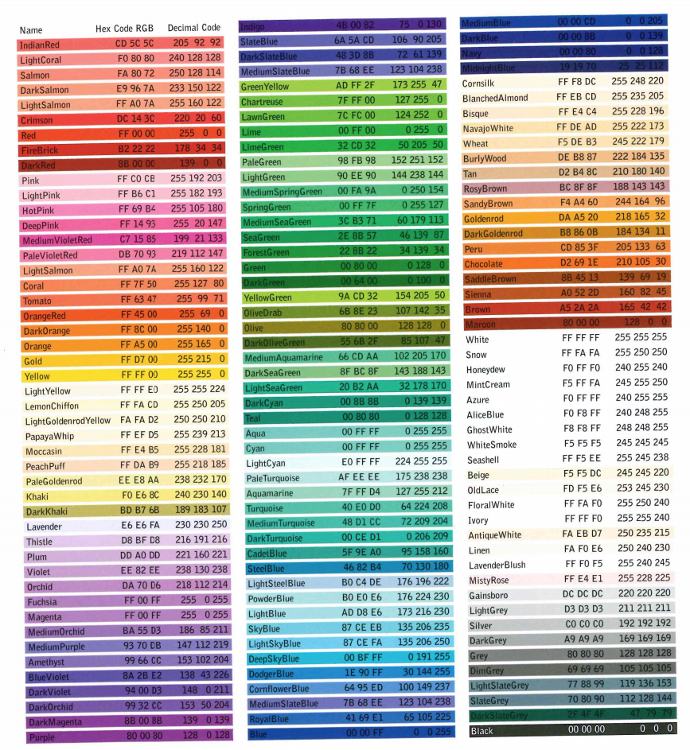

### Styling Text - Part I

*Usefull Font Styles at W3Schools at <a href="https://www.w3schools.com/cssref/css_websafe_fonts.asp">W3 Schools Fonts</a>*

```css 
    p {
        font-family: "Times New Roman", Times, serif;
    }
```
> *The reason to be 3 font styles above is because  if a computer <br> cant render the first, so they have another font options*


> *Exemple:*
```css
    .style {
        font-family: Arial, Helvetica, sans-serif;
        color: goldenrod;
        font-style: italic;
        font-weight: 800;
        font-size: 24px;
        text-transform: capitalize;
        text-align: right;
    }
```
> *In hexadecimal RGB colors ff means the higher value of the color*
> 



