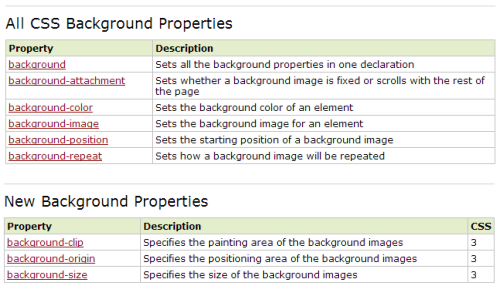

### The Background Propriety



###### Images inside CSS:

```css
#bg {
    width: 500px;
    height: 500px;  
    /*
    background-color: steelblue;
    background-image: url("logo.png");
    
    background-repeat: space;
    background-repeat: round;
    
    background-repeat: no-repeat;
    background-position: bottom;
    */
    background: url("logo.png") no-repeat right center steelblue;
    
    }
```