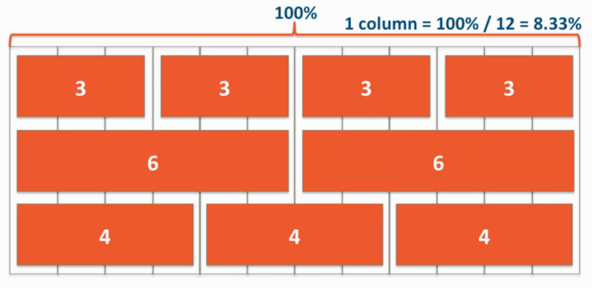
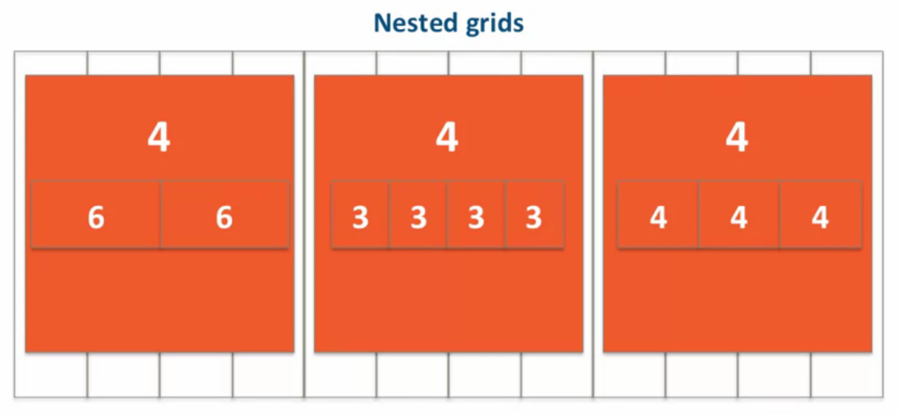

### Responsive Design

Designed to adapt its layout to the viewingenvironment by using fluid, proportion-based grids,flexible images, and CSS3 media queries

> *Site's Layout adapts to the size of the device*
> 
> *Content verbosity or it's visual delivery may change*

Most common layouts is the 12 Column Grid (*is used in Bootstrap*)

