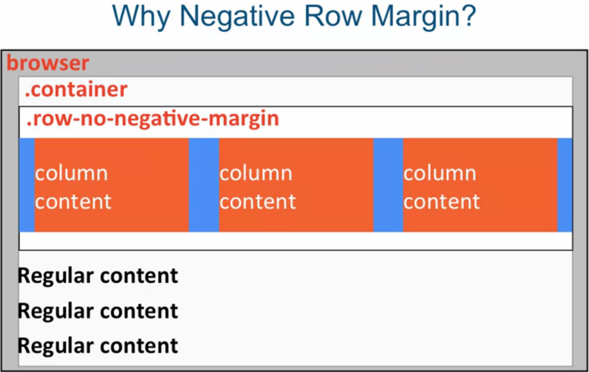
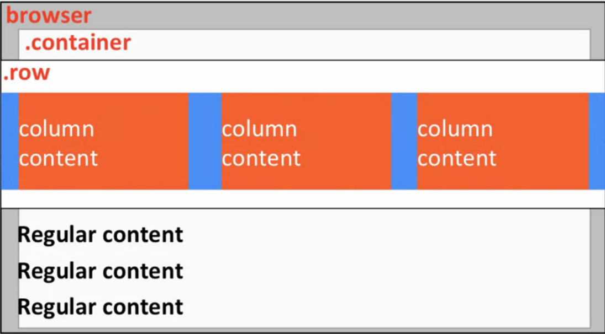

### The Bootstrap Grid System

```html
     <div class="container">
        <div class="row">
            <div class="col-md-4">Column 1</div>
            ...
        </div>
    </div>

```

> <*div class="container"*> 
> 
> Must be inside container 
>
> Fluid Container:
> 
> *The container fluid class stretches your layout the full width of the browser and provides consistent padding around your grid and other content.*
>
> *Other content that could go into the container, not just the grid. It's just that the grid requires that it should be inside a container wrapper.* 
>
> Regular Container:
> 
> *Regular container class has predetermined fixed width that is still responsive based on the width of the browser*
>
> *It has certain width of one break point, a different width at a different break point (media range boundaries) and so on.*

<br>
<br>

> <*div class="row"*>
> 
>  Create horizontal groups of columns
>  Applies negative left and right margins

<br>



<br>
<br>

*What Bootstrap Does:* 



<br>
<br>
<br>
<br>

> <*div class="col-md-4"*>
> Syntax: *col-SIZE-SPAN*
>
> SIZE:
> 
> *Screen width range indentifier*
> *Columns will collapse (stack) below that width (unless other rule applies)*
>
>SPAN:
>*How many columns element should span*
>*Values 1 through 12*
