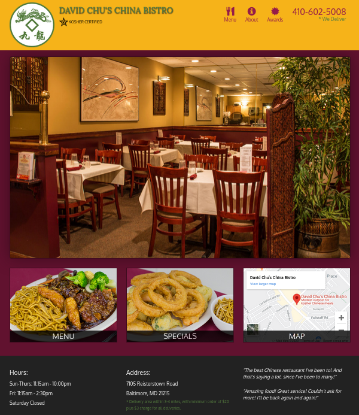

### Module 3

####  David Chu's China Bistro Site Development



<br>
<br>
<br>

> **Attention:**
> 
> Unmutable folders are inside the  root  path.
Mutable folders are inside the lecture class.
Mutable folders are always receiving updates 
through lectures. Paths inside html files are 
redirected to both, root and lecture folders.
It's some kind of wrong practice but the idea 
is avoid  overwriting  earlier  modifications 
to show the steps of a  Web  site Development 
>
> Exemples:
> <br>

```html 

    <link rel="stylesheet" href="../css/bootstrap.min.css">
    <link rel="stylesheet" href="css/styles.css">

    <script src="../js/jquery-2.1.4.min.js"></script>
    <script src="../js/bootstrap.min.js"></script>
    <script src="js/script.js"></script>
```

> <br>
> 
> *Double Dots and a Slash means that the folder 
location is in the root path, so they are unmutable 
folders that contains Bootstrap files.*
> *No Dots and Slash means that the folder sits inside 
the same Lecture Folder, and they are mutable folders.*
>
> <br>

<br>


###### Contents:

|Subject                                        |Lecture  |
|-----------------------------------------------|---------|
|Intro                                          |27-29    |
|Coding the Navigation Bar of the Site          |30-33    |
|Coding the Home Page and The Footer            |34-36    |
|Coding Restaurant Menu Pages                   |37-39    |