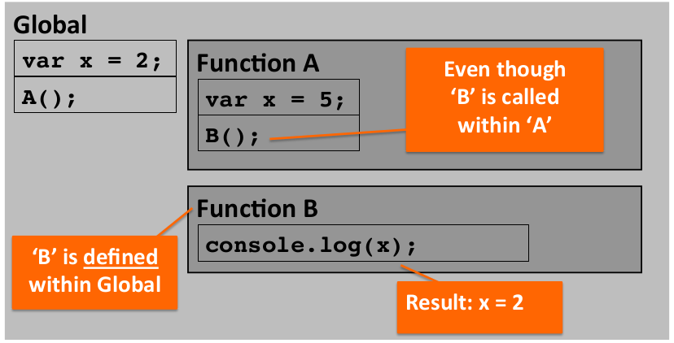

### Defining Variables, Functions and Scope - Part I
[Link to Lesson - Part 1](https://www.coursera.org/learn/html-css-javascript-for-web-developers/lecture/4tOjk/lecture-41-part-1-defining-variables-function-and-scope)

[Link to Lesson - Part 2](https://www.coursera.org/learn/html-css-javascript-for-web-developers/lecture/avyZO/lecture-41-part-2-defining-variables-function-and-scope)
###### Variables

```js
    var message = "hi";
```
> 
> Always start with 'var'
> 
> No types declared (*dynamically typed language*)
> 
> Same variable can hold different types diring the life of the execution
>

```js
    function a () {...}
```
> *'a'* is the name of the function
>
> <br>
> 
>  A variable can hold a function:
```js
    var a = function () {...}
```
> No name defined
> 
> Value of function assigned, NOT the return result
>
> <br>
>
> Defining the function:
```js
    function a () {...}
```
> Invoking (executing) the function :
```js
    a();
```
> An arguments can be defined without '*var*'
> 
> Following syntaxes can be used:
```js 
    function compare (x,y) {
        return x > y;
    }
```

```js
    function compare (x,y) {
    var a = compare (4,5);
    compare (4, "a");
    compare();
```
<br>


###### Scope

|Global|Function|
|------|--------|
|Variables and functions are avaliable everywhere| Variables and functions are avaliable only within this function|


###### Scope Chain
> <br>
> Everything is executed in an Execution Context
> Function invocation creates a new Execution Context
> 
> Each Execution Context has:
> - Its own Variable Enviroment
> - Special 'this' object
> - Reference to its Outer Environment
> - Global scope does not have an Outer Environment as
it’s the most outer there is
>
> Referenced (not defined) variable will be searched for in its current scope first: 
> - If not found, the Outer Reference will be searched. 
> - If not found, the Outer Reference’s  Outer Reference will be searched, etc...  
> 
> *This will keep going until the Global scope*
> 
> - If not found in Global scope, the variable is  
undefined.  



###### Globals exemple:

```js 
    var message = "in global";
    console.log("Global: message = " + message);

    var a = function ( ) {
        var message = "inside a";
        console.log("a: message = " + message);
        b();
    }

    function b ( ) {
        console.log("b: message = " + message);
    }

    a();
```
    Result: 
    
    Global: message = in global
    a: message = inside a
    b: message = in global

<br>

```js
    var message = "in global";
    console.log("Global: message = " + message);

    var a = function( ) {
        var message = "inside a";
        console.log("a: message = " + message);

        function b( ) {
            console.log("b: message = " + message);
        }
        b( );
    }
    a( );
```

    Result:

    Global: message = in global 
    a: message = inside a 
    b: message = inside a

<br>
<br>

