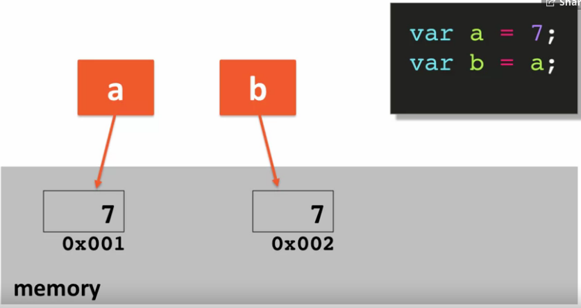
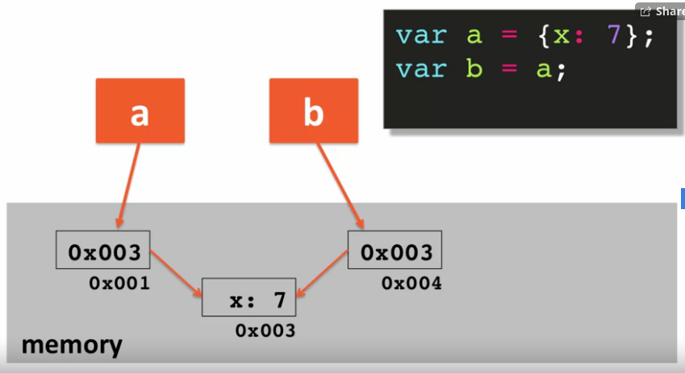
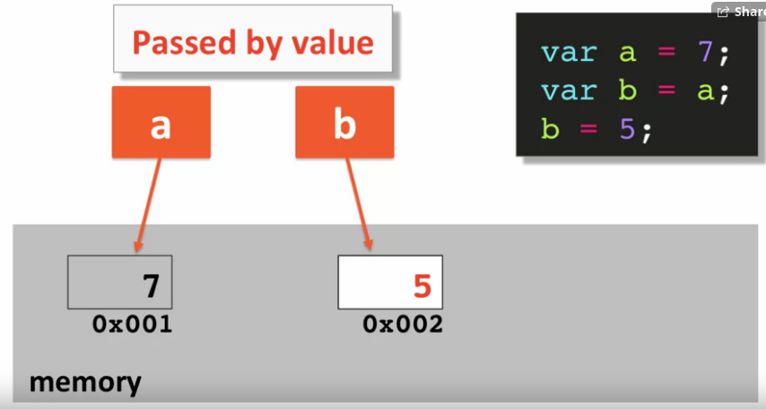
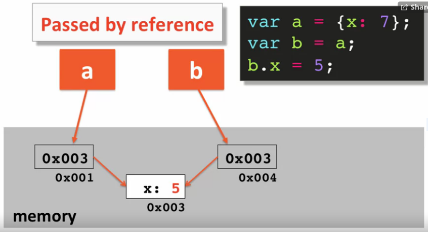

### Passing Variables by Value vs by Reference
[Link to Lesson - Part 1](https://www.coursera.org/learn/html-css-javascript-for-web-developers/lecture/6RF3x/lecture-47-part-1-passing-variables-by-value-vs-by-reference)

[Link to Lesson - Part 2](https://www.coursera.org/learn/html-css-javascript-for-web-developers/lecture/GlV4H/lecture-47-part-2-passing-variables-by-value-vs-by-reference)

###### Passing (or Copying) by Value
Given b=a, passing/copying by value means changing copied value 
in 'b' does not affect the value stored in 'a' and visa-versa

###### Passing (or Copying) by Reference
Given b=a, passing/copying by reference means changing copied value
in 'b' does affect the value stored in 'a' and visa-versa

> Primitives are passed by value, 
> Objects are passed by Reference
>
> "Under the hood", everything is actually passed by value

<br>

###### Memory Allocation

|Primitives|Objects       |
|----------|--------------|
|*Passed by Value*|*Passed by Reference*|
|var a = 7;|var a = {x:7};|
|var b = a;|var b = a;    |
|| |
|| 

> 'b' ends up with the same value as 'a'

<br>

###### Code Exemple:
```js
    function changePrimitive(primValue) {
        console.log("in changePrimitive...");
        console.log("before: " + primValue);

        primValue = 5;
        console.log("after: " + primValue);

    }

    var value = 7;
    changePrimitive(value);
    console.log("after changePrimitive, original value: " + value);
```

        Results:
        in changePrimitive... 
        before: 7 
        after: 5 
        after changePrimitive, original value: 7

```js
    function changeObject(objValue) {
        console.log("in changeObject...");
        console.log("before: " + objValue); 

        objValue.x = 5;
        console.log("after: " + objValue); 

    value = { x: 7 }
    changeObject(value); 
    console.log("after changeObject, original Value:" + value); 
```

        Results:
        in changeObject...
        before: Object {x:7}
        after:  Object {x:5}
        after changeObject, original Value: Object {x:5}
