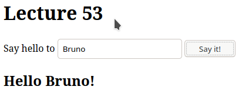
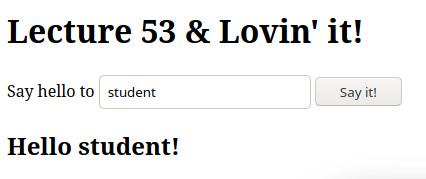

### Lecture 53 - DOM Manipulation - Part II
[Link to Lesson](https://www.coursera.org/learn/html-css-javascript-for-web-developers/lecture/lJMkf/lecture-53-part-2-dom-manipulation)

        HTML Document:
```html
    <!DOCTYPE html>
    <html lang="en">
    <head>
        <meta charset="UTF-8">

    </head>
    <body>
        <h1 id="title">Lecture 53</h1>

        <p>
            Say Hello to
            <input id="name" type="text">
            <button onclick="sayHello();">Say it!
            </button>
        </p>
        <div id="content"></div>
        <script src="js/script.js"></script>
    </body>
    </html>
```
        Script:
```js
    function sayHello() {
        console.log(
            document.getElementById("name")
        );
    }
```
        After button click,
        Result:
        <input id="name" type="text">

        Updating Script:
```js
    function sayHello() {
        console.log(
            document.getElementById("name").value
        );
    }
```

        After filling the form and clicking 'Say it!' button,
        Result:
        value: Bruno

> To output the message in the div of the page, another Update must be placed:

```js
    function sayHello() {
        var name =
            document.getElementById("name").value;
            var message = "Hello " + name + "!"

        document
            .getElementById("content")
            .textContent = message;
    }
```

>  To setup a tag inside html document in JS:
```js
    function sayHello() {
        var name =
            document.getElementById("name").value;
        var message = "<h2>Hello " + name + "!<h2>"

        document
            .getElementById("content")
            .innerHTML = message;
    }
```
        Result:



>  To change h1 tag when the name 'student' is filled:

```js
    function sayHello() {
        var name =
            document.getElementById("name").value;
        var message = "<h2>Hello " + name + "!<h2>"

        document
            .getElementById("content")
            .innerHTML = message;

        if (name === "student") {
            var title =
                //document.getElementById("title")
                document
                //.querySelector("#title")
                .querySelector("h1")
                .textContent;
            title += " & Lovin' it!";
            document
                .querySelector("#title")
                .textContent = title;
        }
    }
```
        Result:

