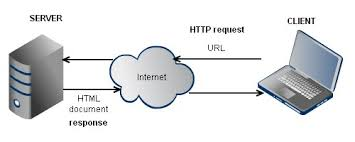

## Introuction to AJAX
### HTTP Basics
 **H**yper**T**ext **T**ransfer **P**rotocol

[Link to Lesson](https://www.coursera.org/learn/html-css-javascript-for-web-developers/lecture/21pyt/lesson-56-http-basics)

> Essentially a client-server communication technique
>
> Based on request/ressponse stateless protocol
>
> Stateless in this context means that when the server responds
to a request from a browser, that response does not depend on any previous requests that the browser made
>
> the HTTP protocol is stateless. There's nothing inherently in it that remembers that you are the same person who requested or made that request between the browser and the server a couple of minutes ago
>
> * Client opens connection to the server
> * Client sends HTTP request for a resource
> * Server sends HTTP response to the cliente with resource
> * Client closes the connection to server
>  

###### URN:
**U**niform **R**esorce **N**ame

> * Uniquely indentifies resource or name of resource
> * Does not tell us how to get the resource
>
> *"HTML/CSS/Javascript/Web Developers/Yaakov/Chaikin"*
###### URI:
**U**niform **R**esorce **I**dentifier

> * Uniquely indentifies resource or location of resource 
> * Does not necessarily tell us how to get the resource
>
> */official_web_site/index.html*