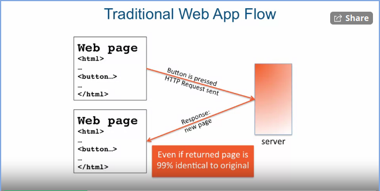
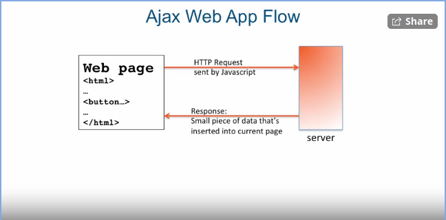
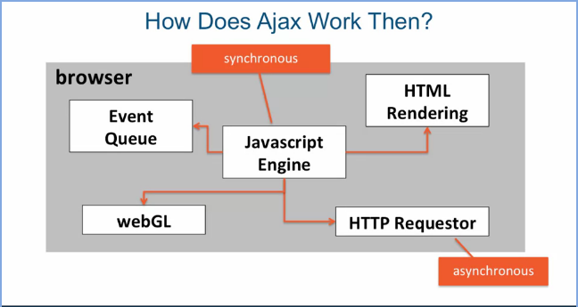
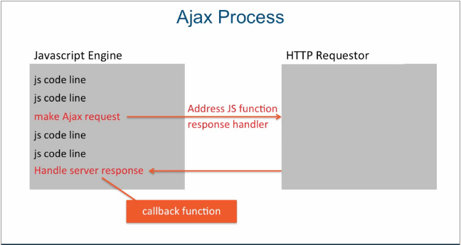

### Ajax Baxics - Part I
[Link to Lesson](https://www.coursera.org/learn/html-css-javascript-for-web-developers/lecture/gncXd/lesson-57-part-1-ajax-basics)
**A**synchronous **J**avascript **A**nd **X**ML
> While Ajax started with XML, very few apps use it nowdays
> * Plain text (at time as html) and JSON is used instead

> Faster response
> * Less Bandwidth, nicer experience for user

###### Synchronous Execution
> Execution of one instruction at a time
> * Can't starts execution of another instruction until the first instruction finished its execution

###### Asynchronous Execution
> Execution of more than one instruction at a time
> * Asynchronous instruction returns right away
> * The actual execution is done in a separate thread or  process

