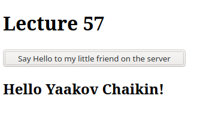

### Ajax Basics - Part III

[Link to Lesson](https://www.coursera.org/learn/html-css-javascript-for-web-developers/lecture/25hv4/lesson-57-part-3-ajax-basics)

        Script.js

```js
   document.addEventListener("DOMContentLoaded",
    function(event) {

        // Unobtrusive event binding
        document.querySelector("button")
            .addEventListener("click", function() {

                // Call server to get the name
                $ajaxUtils
                    .sendGetRequest("data/name.txt",
                        function(request) {
                            var name = request.responseText;

                            document.querySelector("#content")
                                .innerHTML = "<h2>Hello " + name + "!</h2>";
                        });
            });
    }
);
```
        Result:


