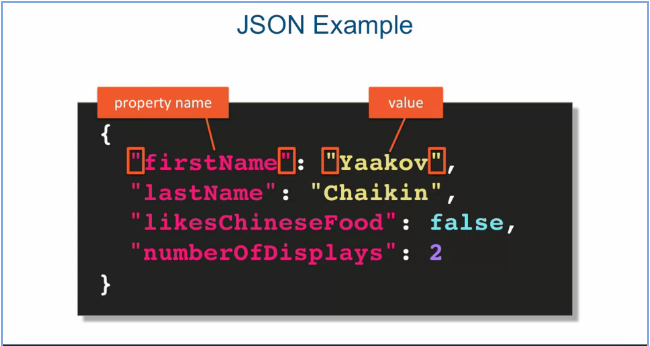
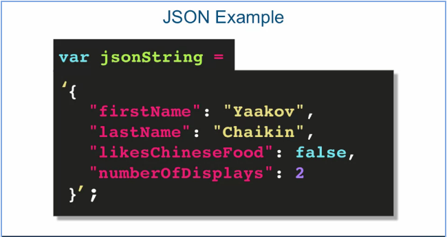

### Processing JSON

[Link to Lesson](https://www.coursera.org/learn/html-css-javascript-for-web-developers/lecture/vzFlv/lecture-58-processing-json)

**J**ava**S**cript **O**bject **N**otation
> Lightweight data-interchange format
> * Simple textual representation of data
>
> Easy for humans to read and write
> Easy for machines to parse and generate
> Completely independent of any language

###### JSON Syntaxe Rules

> Subset of Javascript object literal syntax, but:
> * Propriety names must be in double quotes
> * String values must be in double quotes
> <br>



###### Common Misconception
> JSON is not a JavaScript Object Literal
> JSON is just a String
> The syntax of JSON is based on object literal though
> Need to conver JSON into JS Object


###### Converting JSON to String and Back to JSON

        Converts from JSON string to Object: 

```js
    var obj = JSON.parse(jsonString);
```



        Converts drom Object to JSON String:
```js
    var str = JSON.stringify(obj);
```
